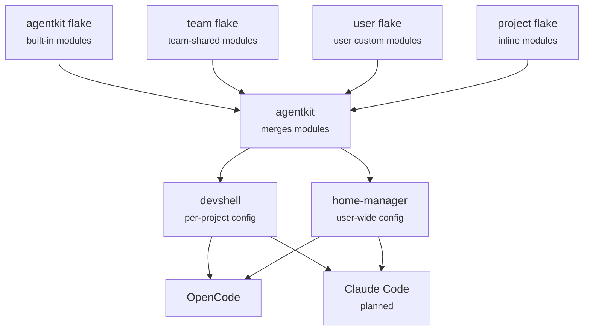

# agentkit

Composable AI agent configuration using Nix flakes.

**agentkit** lets you define, share, and compose Nix modules for AI
coding agents. Author once, deploy everywhere.

**Website:** [agentkit.parts](https://agentkit.parts)

## Quick start

The examples below demonstrate agentkit by configuring the `tldr` skill that ships with agentkit.
It teaches your agent to look up unfamiliar CLI tools via [tldr pages](https://tldr.sh) and
provides `tealdeer` as a dependency.

### Per project with devshell

Install skills per-project in a devshell. When anyone runs `nix develop`, all agent
runtimes are configured automatically.

```nix
# In your project's flake.nix
{
  inputs = {
    nixpkgs.url = "github:NixOS/nixpkgs/nixpkgs-unstable";
    flake-parts.url = "github:hercules-ci/flake-parts";
    agentkit.url = "github:ungood/agentkit";
  };

  outputs = inputs@{ flake-parts, ... }:
    flake-parts.lib.mkFlake { inherit inputs; } {
      systems = [ "x86_64-linux" "aarch64-linux" "x86_64-darwin" "aarch64-darwin" ];

      imports = [
        inputs.agentkit.flakeModules.default
      ];

      perSystem = { config, pkgs, ... }: {
        agentkit = {
          enable = true;
          runtimes.opencode.enable = true;

          # Enable a built-in skill
          skills.tldr.enable = true;

          # Define an inline skill with its package dependency
          skills.lolcat = {
            path = ./skills/lolcat;
            packages = [ pkgs.lolcat ];
          };
        };

        devShells.default = pkgs.mkShell {
          inputsFrom = [ config.agentkit.devshell.shell ];
        };
      };
    };
}
```

### Per user with home-manager

Install skills at the user level. Every project you work in has the skills available.

```nix
# In your home-manager configuration
{ inputs, pkgs, ... }:
{
  imports = [
    inputs.agentkit.homeModules.default
  ];

  agentkit = {
    runtimes.opencode.enable = true;

    skills = {
      # Enable a built-in skill
      tldr.enable = true;

      # Define an inline skill with its package dependency
      lolcat = {
        path = ./skills/lolcat;
        packages = [ pkgs.lolcat ];
      };
    };
  };
}
```

### Composing multiple modules

Import skill modules from other flakes -- they merge automatically:

```nix
imports = [
  inputs.agentkit.flakeModules.default
  inputs.my-team-skills.flakeModules.default
];

perSystem = { config, pkgs, ... }: {
  agentkit = {
    enable = true;
    runtimes.opencode.enable = true;
    skills = {
      tldr.enable = true;
      my-team-skill.enable = true;
    };
  };

  devShells.default = pkgs.mkShell {
    inputsFrom = [ config.agentkit.devshell.shell ];
  };
};
```

## How it works

Nix flakes export modules via agentkit's flake-parts options. These
compose through the Nix module system and are deployed to supported agent runtimes via adapters.



## Authoring modules

To create your own agentkit modules, see [docs/authoring-modules.md](docs/authoring-modules.md).

## Contributing

See [CONTRIBUTING.md](CONTRIBUTING.md).

## License

[MIT](LICENSE)
